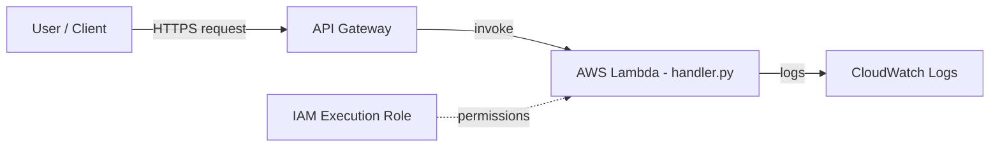

# Architecture — Serverless Web Application (Lambda & API Gateway)

A fully serverless application: API Gateway exposes an HTTP endpoint that invokes an AWS Lambda function, with IAM for permissions and CloudWatch for logging.

## How it works

- API Gateway provides the public HTTPS endpoint and routes requests to Lambda.
- The Lambda function runs the business logic without any servers to manage.
- An IAM execution role grants the function least-privilege access to AWS services.
- CloudWatch Logs captures function output and errors for observability.
